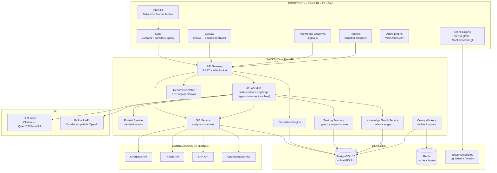
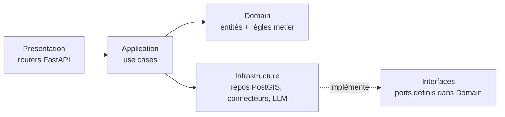
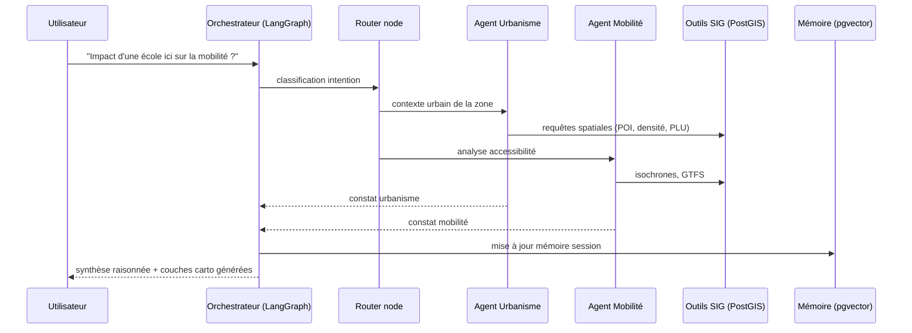
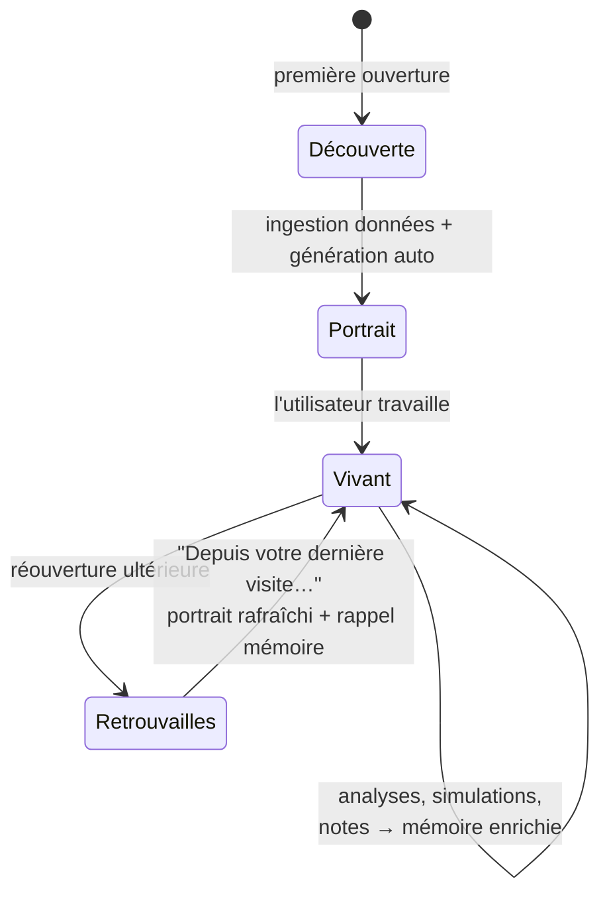
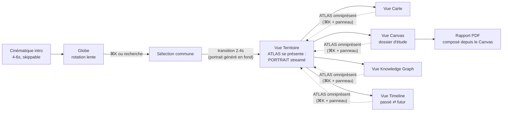

# ATLAS — The Territory Intelligence System
## Document de conception — Phase 0 (v1.1) ✅ VALIDÉE

> Statut : validée le 03/07/2026. Contrat de référence pour le développement.
> Auteur : Oum + Claude · Juillet 2026
> v1.1 : recentrage "intelligence territoriale" — IA au cœur, agents invisibles, territoire vivant, Canvas, mémoire persistante, Timeline, Knowledge Graph.

---

# -1. POSITIONNEMENT PRODUIT (fondamental)

**ATLAS n'est pas un SIG augmenté par l'IA. C'est une intelligence territoriale qui utilise la carte comme langage.**

Les 5 principes non négociables :

1. **Une seule entité : ATLAS.** L'utilisateur ne voit jamais d'"agents". En interne, l'orchestrateur LangGraph route vers des agents spécialisés, mais tout est restitué d'une seule voix, avec une seule identité, un seul ton. Les étapes de raisonnement visibles disent "ATLAS analyse la densité…", jamais "Agent Urbanisme".
2. **Le territoire est une entité vivante.** Chaque territoire possède une identité (portrait, traits caractéristiques), une mémoire (tout ce qu'ATLAS a appris et produit dessus), un historique (évolution réelle passée) et un futur (simulations). Rouvrir un territoire = retrouver une relation en cours, pas repartir de zéro.
3. **ATLAS parle en premier.** À l'ouverture d'un territoire, ATLAS génère spontanément un **Portrait** : forces, faiblesses, tendances, risques, opportunités, résumé rédigé. L'utilisateur n'a rien demandé — c'est ça, l'intelligence.
4. **La carte est un support, pas le centre.** Elle reste magnifique et plein écran, mais elle illustre le raisonnement d'ATLAS. Le Canvas, la Timeline et le Knowledge Graph sont d'autres supports du même raisonnement.
5. **Périmètre : géomatique et territoire, exclusivement.** ATLAS refuse poliment tout ce qui sort du territorial. C'est son identité, pas une limitation.

---

# 0. SCOPING STRATÉGIQUE

Le spec complet correspond à ~2 ans de travail pour une équipe. Pour un portfolio percutant avant septembre 2026, on découpe en **3 horizons** :

## Horizon 1 — "ATLAS Core" (V1 portfolio, ~12-13 semaines)
Ce qui doit exister et être **parfait** :
- Cinématique d'ouverture (globe Three.js custom, pas Cesium — plus léger, plus contrôlable)
- Scène carto : **MapLibre GL + deck.gl** (2D/3D bâtiments/terrain, heatmaps, clusters) — support de visualisation
- Transition globe → territoire cinématique (le moment "wow")
- **L'esprit ATLAS** : orchestrateur LangGraph + 3 agents internes invisibles (Urbanisme, Mobilité, Démographie), voix unique
- **Portrait de territoire** auto-généré à l'ouverture (forces/faiblesses/tendances/risques/opportunités + résumé rédigé)
- **Mémoire persistante par territoire** (pgvector) : analyses, hypothèses, simulations, rapports — rappelés naturellement
- **Canvas** (espace de travail infini façon FigJam) : cartes, analyses, notes, simulations épinglées → dossier d'étude
- **Timeline** (version 1) : évolution démographique/urbaine réelle (séries INSEE 1968→2022, bâti) + projection des simulations
- **Knowledge Graph** (version lite) : graphe interactif des entités du territoire (équipements, réseaux, entreprises, communes voisines) — les nœuds mobilisés par un raisonnement s'illuminent
- Connecteurs données : **OSM (Overpass), INSEE, BAN, GeoJSON/GPKG import**
- 1 simulation phare : **impact d'un nouvel équipement** (école/métro) expliqué par ATLAS
- Export rapport PDF (alimenté par le Canvas)
- Design system complet, lecteur audio ambient (2-3 pistes libres de droits)

## Horizon 2 — "ATLAS Pro" (post-V1)
Cesium en mode globe optionnel, agents internes supplémentaires (Climat, Immobilier, Énergie), GTFS + ORS, Timeline avancée (scénarios comparés), Knowledge Graph complet inter-territoires, Canvas collaboratif, export PPTX/StoryMaps, Lidar/orthophotos.

## Horizon 3 — "ATLAS Vision"
Simulation multi-agents complète, comparaison temporelle, collaboration temps réel, marketplace de connecteurs.

**Règle d'or** : chaque feature de la V1 doit être au niveau Linear/Figma en finition. Mieux vaut 8 features parfaites que 40 moyennes.

---

# 1. ARCHITECTURE GLOBALE

## 1.1 Vue d'ensemble



## 1.2 Clean Architecture (backend)



- **Domain** : `Territory`, `Layer`, `Analysis`, `Simulation`, `Agent`, `Report` — zéro dépendance externe.
- **Application** : use cases (`RunIsochroneAnalysis`, `AskTerritoryQuestion`, `SimulateEquipment`).
- **Infrastructure** : implémentations concrètes (SQLAlchemy/GeoAlchemy2, httpx, LangGraph).
- **Presentation** : routers, schémas Pydantic, WebSocket pour le streaming IA.

## 1.3 Flux IA (orchestrateur)



Points clés :
- **Les agents sont une abstraction interne.** Aucune trace côté client : les étapes streamées sont reformulées à la première personne ("J'analyse la densité du bâti… ✓"). Un seul ton, une seule identité : ATLAS. Le champ `agent` des traces internes ne sort jamais de l'API publique.
- Les agents ne répondent jamais "de tête" : chaque affirmation chiffrée vient d'un **tool call PostGIS** traçable.
- **Mémoire d'abord** : chaque requête commence par une récupération dans la mémoire du territoire (pgvector). Si une analyse similaire existe, ATLAS le dit ("En mars, nous avions estimé… voici ce qui a changé").
- L'orchestrateur retourne du **JSON structuré** : `{ narrative, layers[], charts[], kg_nodes[], canvas_suggestions[], confidence, sources[] }` → le front rend les couches sur la carte, illumine les nœuds du Knowledge Graph mobilisés, et propose d'épingler le résultat au Canvas.
- Streaming via WebSocket : le raisonnement apparaît progressivement.

## 1.4 Cycle de vie d'un territoire (entité vivante)



Le **Portrait** est généré en tâche de fond (Celery) dès la sélection : pendant la transition cinématique globe→territoire (~2,4s), l'ingestion et la synthèse démarrent. À l'arrivée, les premières lignes du portrait apparaissent en streaming — l'impression que le territoire "se présente".

---

# 2. STRUCTURE DES DOSSIERS

```
atlas/
├── apps/
│   ├── web/                          # Frontend
│   │   ├── src/
│   │   │   ├── app/                  # routing, providers, shell
│   │   │   ├── features/
│   │   │   │   ├── intro/            # cinématique d'ouverture
│   │   │   │   ├── globe/            # globe Three.js
│   │   │   │   ├── map/              # MapLibre + deck.gl
│   │   │   │   ├── territory/        # portrait + identité du territoire
│   │   │   │   ├── mind/             # dialogue avec ATLAS (voix unique)
│   │   │   │   ├── canvas/           # espace de travail xyflow
│   │   │   │   ├── knowledge-graph/  # viz sigma.js
│   │   │   │   ├── timeline/         # scrubber passé/futur
│   │   │   │   ├── simulation/
│   │   │   │   ├── layers/           # gestionnaire de couches
│   │   │   │   ├── reports/
│   │   │   │   └── audio/            # lecteur musique
│   │   │   ├── design-system/
│   │   │   │   ├── tokens/           # couleurs, typo, espacements, motion
│   │   │   │   ├── primitives/       # Button, Panel, Input, Tooltip…
│   │   │   │   └── motion/           # variants Framer Motion partagés
│   │   │   ├── lib/                  # api client, ws, utils geo
│   │   │   └── stores/               # Zustand
│   │   └── public/audio/
│   └── api/                          # Backend
│       ├── src/atlas/
│       │   ├── domain/               # entités, value objects, ports
│       │   ├── application/          # use cases
│       │   ├── infrastructure/
│       │   │   ├── db/               # SQLAlchemy, migrations Alembic
│       │   │   ├── connectors/       # osm, insee, ban, ors
│       │   │   ├── mind/             # langgraph : orchestrateur, agents internes,
│       │   │   │                     #   portrait, mémoire, persona ATLAS
│       │   │   ├── knowledge_graph/  # extraction entités + relations
│       │   │   └── reports/
│       │   ├── presentation/         # routers, schemas, ws
│       │   └── workers/              # tâches Celery
│       └── tests/                    # unit / integration / e2e
├── infra/
│   ├── docker-compose.yml            # pg+postgis, redis, martin, ollama
│   └── ci/                           # GitHub Actions
├── docs/                             # ADRs, guides, ce document
└── data/seeds/                       # communes de démo pré-chargées
```

Monorepo simple (pas de Turborepo en V1 — inutile pour 2 apps).

---

# 3. CHOIX TECHNOLOGIQUES (justifiés)

| Besoin | Choix V1 | Pourquoi |
|---|---|---|
| Globe d'intro | **Three.js custom** | Contrôle total du rendu cinématique, léger (~150ko de géométrie), shaders custom (tu maîtrises déjà). Cesium = 4Mo + look "Cesium" reconnaissable. |
| Carto principale | **MapLibre GL** | Style vectoriel custom (dark premium), perf, licence libre. |
| Couches data | **deck.gl** | Heatmaps/clusters/arcs GPU, interop MapLibre native. |
| Terrain 3D | MapLibre terrain (RGB-DEM IGN) | Suffisant en V1, Cesium en H2. |
| État front | **Zustand** + TanStack Query | Simple, performant, pas de boilerplate Redux. |
| Animations | **Framer Motion** + GSAP (cinématique) | Tu connais GSAP ; Framer pour l'UI déclarative. |
| Orchestration IA | **LangGraph** | Graphes d'agents avec état, checkpoints, streaming natif. |
| LLM | **Ollama (Qwen2.5-14B ou Llama 3.1-8B)** + fallback API | Démo offline possible + coût zéro. Interface OpenAI-compatible = swap facile. |
| Mémoire territoires | **pgvector** dans PostgreSQL | Une seule base ; mémoire hybride (structurée jsonb + sémantique vecteurs). |
| Canvas | **@xyflow/react** (React Flow) | Canvas infini pan/zoom, nœuds custom React (mini-cartes, graphiques, notes), MIT, perf éprouvée. tldraw écarté (watermark/licence). |
| Knowledge Graph (stockage) | Tables `kg_nodes`/`kg_edges` PostgreSQL | Pas de Neo4j en V1 : volumétrie faible (centaines de nœuds/territoire), requêtes récursives CTE suffisent, une seule base. |
| Knowledge Graph (viz) | **sigma.js + graphology** | Rendu WebGL fluide à des milliers de nœuds, layout force-atlas, esthétique contrôlable. |
| Timeline (données) | Séries historiques INSEE + millésimes bâti | Population 1968→2022, logements, emploi ; simulations projetées au-delà de 2026. |
| Tuiles | **martin** (Rust) | Tuiles vectorielles depuis PostGIS, ultra rapide, zéro config. |
| Rapports PDF | **WeasyPrint** (HTML→PDF) | Templates HTML/CSS = même design system que l'app. |
| CI/CD | GitHub Actions → Vercel (front) + VPS/Railway (back) | Cohérent avec ton setup actuel. |

---

# 4. MODÈLE DE DONNÉES (cœur)

```mermaid
erDiagram
    TERRITORY ||--o{ LAYER : contient
    TERRITORY ||--o{ ANALYSIS : concerne
    TERRITORY ||--o{ SIMULATION : concerne
    ANALYSIS ||--o{ ANALYSIS_RESULT : produit
    SIMULATION ||--o{ SIMULATION_RESULT : produit
    SESSION ||--o{ MESSAGE : contient
    MESSAGE ||--o{ AGENT_STEP : trace
    ANALYSIS_RESULT ||--o{ REPORT_SECTION : alimente
    REPORT ||--o{ REPORT_SECTION : compose

    TERRITORY {
        uuid id PK
        text code_insee
        text name
        geometry boundary "MultiPolygon 4326"
        jsonb stats_cache "population, superficie…"
    }
    LAYER {
        uuid id PK
        text type "osm_buildings|heatmap|isochrone|custom"
        text source
        geometry geom
        jsonb style
        jsonb properties
    }
    ANALYSIS {
        uuid id PK
        text kind "isochrone|density|accessibility"
        jsonb params
        text status
    }
    SIMULATION {
        uuid id PK
        text kind "new_equipment|new_transit_line"
        jsonb scenario
        jsonb impact "delta accessibilité, population desservie"
    }
    SESSION {
        uuid id PK
        uuid territory_id FK
    }
    AGENT_STEP {
        uuid id PK
        text agent "interne uniquement — jamais exposé"
        jsonb tool_calls
        text reasoning
    }
    PORTRAIT {
        uuid id PK
        uuid territory_id FK
        jsonb strengths_weaknesses "forces, faiblesses"
        jsonb trends_risks_opportunities
        text narrative "résumé rédigé"
        timestamptz generated_at
        jsonb sources
    }
    TERRITORY_MEMORY {
        uuid id PK
        uuid territory_id FK
        text kind "analysis|hypothesis|simulation|report|fact|note"
        text content
        vector embedding "pgvector 1024d"
        jsonb refs "liens vers analyses/simulations"
        timestamptz created_at
    }
    CANVAS {
        uuid id PK
        uuid territory_id FK
        text title "dossier d'étude"
    }
    CANVAS_ITEM {
        uuid id PK
        uuid canvas_id FK
        text type "map_snapshot|analysis|chart|note|simulation|report_block"
        jsonb position "x, y, w, h, z"
        jsonb content
        uuid source_ref "analysis_id, simulation_id…"
    }
    KG_NODE {
        uuid id PK
        uuid territory_id FK
        text type "commune|equipement|entreprise|reseau|quartier|demographic"
        text label
        jsonb properties
        geometry geom "optionnel"
    }
    KG_EDGE {
        uuid id PK
        uuid source_id FK
        uuid target_id FK
        text relation "dessert|voisin_de|situe_dans|emploie|alimente"
        jsonb properties
    }
    TIMELINE_POINT {
        uuid id PK
        uuid territory_id FK
        int year
        text metric "population|logements|emploi"
        numeric value
        text origin "insee_historical|simulation"
        uuid simulation_id "si projection"
    }

    TERRITORY ||--|| PORTRAIT : possede
    TERRITORY ||--o{ TERRITORY_MEMORY : se_souvient
    TERRITORY ||--o{ CANVAS : dossiers
    CANVAS ||--o{ CANVAS_ITEM : contient
    TERRITORY ||--o{ KG_NODE : entites
    KG_NODE ||--o{ KG_EDGE : relie
    TERRITORY ||--o{ TIMELINE_POINT : evolution
```



Tables techniques en plus : `data_sources` (connecteurs + fraîcheur), `jobs` (Celery), `users` (H2).

**Mémoire hybride** : la couche structurée (`kind`, `refs`, dates) permet le rappel chronologique exact ("le 12 mai, simulation X") ; la couche vectorielle permet le rappel sémantique ("on avait déjà parlé d'accessibilité scolaire ?"). Le Portrait est **rafraîchi** quand la mémoire s'enrichit significativement — le territoire évolue avec le travail.

---

# 5. DESIGN SYSTEM

## 5.1 Tokens

```
Couleurs
  --bg-void:        #0A0A0B    (noir profond, fond scène)
  --bg-surface:     #131316    (panneaux)
  --bg-elevated:    #1A1A1F    (modales, dropdowns)
  --glass:          rgba(19,19,22,0.72) + backdrop-blur(24px)
  --border-subtle:  rgba(255,255,255,0.06)
  --border-strong:  rgba(255,255,255,0.12)
  --text-primary:   #F4F4F2    (blanc cassé)
  --text-secondary: #9C9CA3
  --text-tertiary:  #5C5C63
  --accent:         #3B82F6 → #60A5FA (bleu électrique, gradients subtils)
  --accent-glow:    0 0 24px rgba(59,130,246,0.35)
  --success/warn/danger : désaturés, jamais criards

Typographie
  Display : "Instrument Serif" ou "PP Editorial" (titres, chiffres clés)
  UI      : "Inter" variable (interface)
  Mono    : "Geist Mono" (coordonnées, données, code)
  Échelle : 12 / 13 / 15 / 18 / 24 / 36 / 56

Rayons     : 6 / 10 / 16 / 24
Ombres     : douces, multicouches, jamais dures
Espacement : grille 4px
```

## 5.2 Motion

```
Durées   : micro 120ms · UI 240ms · panneaux 400ms · cinématique 1200-2400ms
Easings  : easeOutExpo (entrées) · easeInOutQuart (transitions caméra)
           spring(stiffness:260, damping:28) pour les micro-interactions
Règles   : jamais 2 animations concurrentes sur le même élément ·
           stagger 40-60ms sur les listes · reduce-motion respecté ·
           60fps garanti = transform/opacity uniquement, jamais layout
```

## 5.3 Composants clés (primitives)

`GlassPanel` · `CommandBar` (⌘K, façon Raycast — point d'entrée IA) · `LayerCard` · `AgentMessage` (avec étapes de raisonnement dépliables) · `MetricTile` (chiffre animé count-up) · `TimelineScrubber` · `AudioPlayer` (mini, coin bas-gauche, spectre discret) · `Tooltip` · `Toast` · `ContextMenu`.

---

# 6. FLUX DE NAVIGATION & WIREFRAMES

## 6.1 Flux principal



Les 4 vues sont des **facettes du même territoire**, pas des pages : la transition entre elles est animée (la carte se réduit en carte-nœud dans le graphe, le graphe se déplie en timeline…). ATLAS reste accessible partout via ⌘K et le panneau de dialogue.

## 6.2 Layout Vue Territoire (wireframe textuel)

```
┌────────────────────────────────────────────────────────────┐
│ ◉ ATLAS   Saint-Denis ▾   [⌘K]                 ○ ○ ○  ⚙   │  ← barre fine, verre
├──────┬─────────────────────────────────────────┬───────────┤
│      │                                         │  PANNEAU  │
│ Rail │        SCÈNE (selon la vue :            │  ATLAS    │
│ vues │        Carte · Canvas · Graph ·         │           │
│      │        Timeline)                        │ Portrait, │
│ 🗺 ▦  │                                         │ dialogue, │
│ ◉ ⏱  │   [contrôles flottants contextuels]     │ mémoire   │
│      │                                         │ (glass,   │
│      │                                         │  400px)   │
├──────┴──────────────────────────────┬──────────┴───────────┤
│ ♪ lecteur mini                      │ 48.9362, 2.3574 · IGN│
└─────────────────────────────────────┴──────────────────────┘
```

Principes :
- **La scène n'est jamais réduite à une vignette.** Tout flotte au-dessus en verre.
- **Le panneau ATLAS est la présence permanente** : à l'ouverture il porte le Portrait ; ensuite le dialogue et les rappels mémoire ("Depuis votre dernière visite…"). Son raisonnement pilote la scène active en direct : couches qui s'allument sur la carte, nœuds qui s'illuminent dans le graphe, curseur qui se déplace sur la timeline.
- **Tout résultat est épinglable au Canvas** en un geste (bouton "→ dossier" sur chaque analyse/carte/graphique). Le rapport PDF final se compose depuis le Canvas.

---

# 7. PIPELINE SIG

1. **Ingestion** : connecteur → normalisation (EPSG:4326, schéma commun) → PostGIS → invalidation cache tuiles.
2. **Analyses** (use cases exposés comme *outils* aux agents ET comme boutons UI) :
   - `isochrone(point, mode, minutes)` → ORS ou pgRouting
   - `density(territory, dataset)` → grille H3 + agrégation
   - `accessibility(territory, poi_type)` → population desservie par isochrone
   - `buffer/intersect/within` → primitives PostGIS
3. **Rendu** : résultats stockés en `layers` → servis en tuiles vectorielles (martin) ou GeoJSON si < 5000 features → deck.gl.
4. **Simulation** = analyse "avant/après" : on injecte l'équipement virtuel, on recalcule, on diff, l'IA explique le delta.

---

# 8. ROADMAP & BACKLOG

## Épics (V1) — ordre de réalisation

| # | Épic | Tâches | Durée est. |
|---|---|---|---|
| E0 | Fondations (repo, docker, CI, design tokens) | 8 | 1 sem |
| E1 | Shell UI + design system primitives | 12 | 1,5 sem |
| E2 | Globe + cinématique intro | 10 | 1,5 sem |
| E3 | Carto MapLibre/deck.gl + transition globe→territoire | 14 | 2 sem |
| E4 | Backend core + PostGIS + connecteurs (OSM, INSEE, BAN) | 14 | 2 sem |
| E5 | Analyses SIG (isochrones, densité, accessibilité) | 10 | 1,5 sem |
| E6 | **L'esprit ATLAS** : orchestrateur voix unique + agents internes + **mémoire persistante** + **Portrait auto** + streaming | 18 | 2,5 sem |
| E7 | Simulation équipement + explication ATLAS | 8 | 1 sem |
| E8 | **Canvas** : espace de travail xyflow, nœuds custom, épinglage depuis toutes les vues | 12 | 1,5 sem |
| E9 | **Knowledge Graph lite** + **Timeline v1** (2 vues, transitions animées) | 12 | 1,5 sem |
| E10 | Rapport PDF depuis Canvas + audio player + polish final | 10 | 1,5 sem |

**Total ≈ 118 tâches, ~12-13 semaines** en parallèle de ta recherche d'emploi. Les nouveautés v1.1 coûtent ~3 semaines de plus que la v1.0 — assumé, c'est ce qui fait l'identité du produit. Si le calendrier serre : E9 est le premier fusible (KG/Timeline glissent en H2), jamais E6.

## E0 détaillé — les 8 premières tâches

- **T-001** · Init monorepo (`apps/web`, `apps/api`), README, licence, conventions de commit
- **T-002** · `docker-compose.yml` : postgres+postgis+pgvector, redis, martin, ollama
- **T-003** · Scaffold front : Vite + React + TS strict + Tailwind + ESLint/Prettier
- **T-004** · Scaffold back : FastAPI + structure Clean Architecture + Alembic + healthcheck
- **T-005** · Design tokens (CSS variables + config Tailwind) + typo chargées
- **T-006** · CI GitHub Actions : lint + typecheck + tests sur PR
- **T-007** · Seed data : 3 communes de démo (Saint-Denis, une rurale, une littorale) — limites + stats INSEE
- **T-008** · ADR-001 à 003 : choix globe custom, choix LLM local, choix martin

Chaque tâche suit le protocole : implémentation → review → perf → doc → **ta validation** → suivante.

---

# 9. RISQUES & PARADES

| Risque | Parade |
|---|---|
| Cinématique 3D = puits de temps | Timeboxer E2 à 1,5 sem strict ; version "belle mais simple" d'abord, shaders avancés en polish |
| LLM local trop lent pour la démo | Streaming + étapes visibles masquent la latence ; fallback API pour les démos live |
| Scope creep (le spec est infini) | Ce document = contrat. Toute idée hors V1 → backlog H2, pas de négo |
| Données Overpass instables | Cache PostGIS agressif + seeds pré-chargés pour les 3 communes démo |
| Musique = droits | Pistes CC0/libres (ex. Kevin MacLeod, ou génération via Higgsfield/Suno) |

---

# 10. STATUT

✅ **Phase 0 validée le 03/07/2026** (v1.1, recentrage intelligence territoriale intégré).
Développement en cours selon le protocole : une tâche à la fois, terminée, documentée, validée.

Journal :
- **T-001** · Init monorepo — ✅ validée
- **Phase 1** · Identité produit (docs/IDENTITE.md) — ✅ validée le 03/07/2026
- **T-002** · docker-compose — ✅ validée (testée sur Mac arm64)
- **T-003** · Scaffold frontend — livrée, en attente de validation
